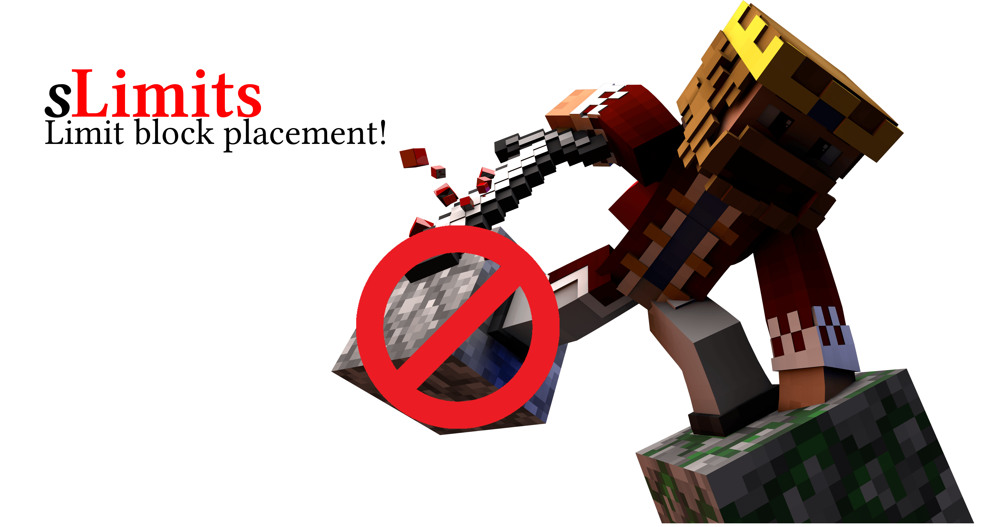

# sLimits

[](../../actions?query=workflow%3ABuild)
[](../../releases)

[](https://www.spigotmc.org/resources/slimits.78922/)
[](https://www.spigotmc.org/resources/slimits.78922/)
[](http://commitizen.github.io/cz-cli/)
[](https://github.com/semantic-release/semantic-release)

[](https://www.spigotmc.org/resources/slimits.78922/)


## Features

The plugin currently has the following features. Please [open a feature request](https://github.com/Silthus/sLimits/issues/new?assignees=&labels=&template=feature_request.md&title=) if you want a feature added.

- **Limiting block placement** based on limits configured inside `config.yml`.
- Keeps **track** of the **placed blocks** and destroying them decreases the limit counter.
- **Blocks destruction** of limited blocks by other players.
- **Simple flatfile storage.**

## Installation

Simply drop the plugin into your `plugins` folder and restart your server.

## Configuration

There is a main `config.yml` in the plugins directory which holds all the options.

```yaml
# The time interval to save the placed blocks to the disk storage
# set to 0 to disable automatic saving
save-interval-ticks: 200
storage:
  # the location relative to the plugin dir where the placed blocks are saved
  block_placement: storage/block_placement/
limits:
  block_placement:
    # permission: slimits.limits.block_placement.stones
    stones:
      type: stone
      limit: 10
      # optionally deny breaking limited blocks placed by others
      # default: false - everybody can break limited blocks of others
      deny-breaking-by-others: true
    # permission: slimits.limits.block_placement.bedrocks-10
    bedrocks-10:
      type: bedrock
      limit: 10
    # permission: slimits.limits.block_placement.bedrocks-20
    bedrocks-20:
      type: bedrock
      limit: 20
```

## Permissions

The players require the limit's permission for it to be applied. The permission is created from the limit's key: `slimits.limits.block_placement.<limit_key>`. The permission can be customized by setting it in the limit's config.

```yaml
limits:
  block_placement:
    # permission: my-super-permission
    stones:
      type: stone
      limit: 10
      permission: my-super-permission
```

### Additional Permissions

You can give players the following permission to ignore all limits: `slimits.limits.ignore`.

> **NOTE**  
> Players with OP rights will have this permission by default and are therefore excluded from all limits.  
> Explicitly deny them the permission to allow limiting their actions.

## Commands

Most of the commands are for admins to reload and save limits. Players have one command to show their current limits: `/limits`.

| Command | Permission | Description |
| ------- | ---------- | ----------- |
| `/limits` | `slimits.player.list` | Lists all active limits of the player. |
| `/limits list <player>` | `slimits.admin.list` | Lists the active limits of another online player. |
| `/limits save` | `slimits.admin.save` | Saves the current limit cache to disk. |
| `/limits reload` | `slimits.admin.reload` | Saves all limits and reloads them from the config. |